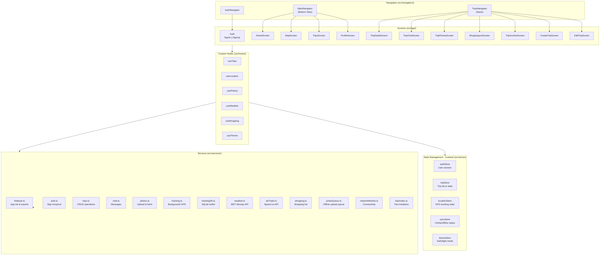
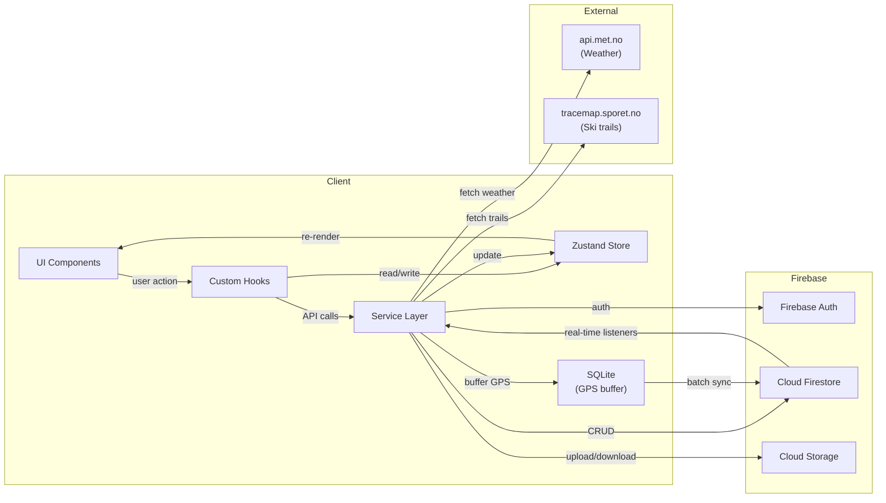
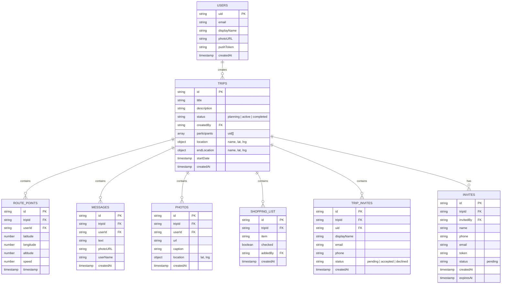
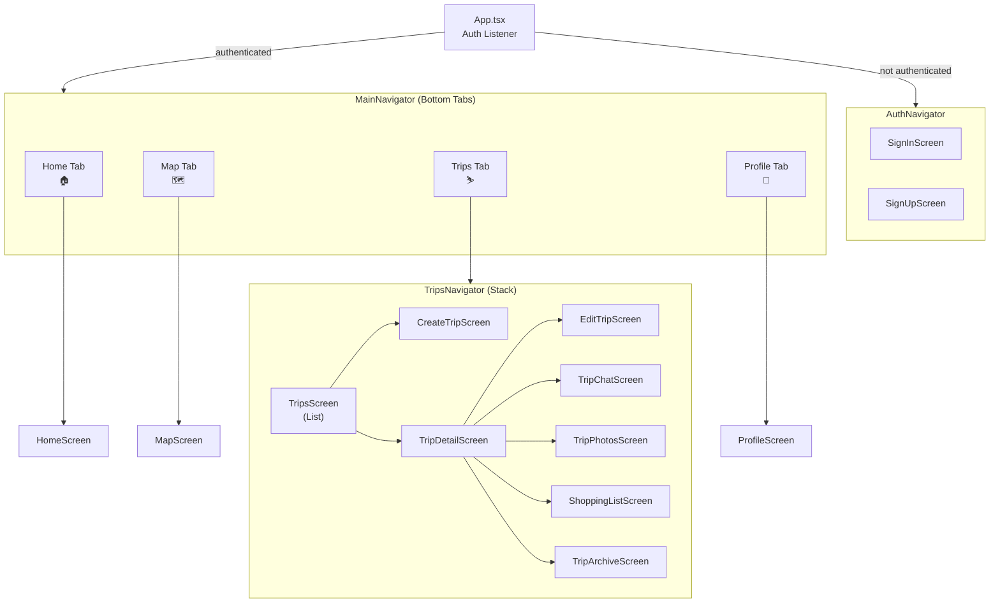
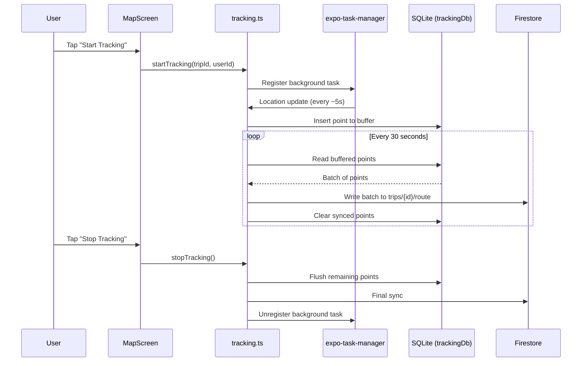
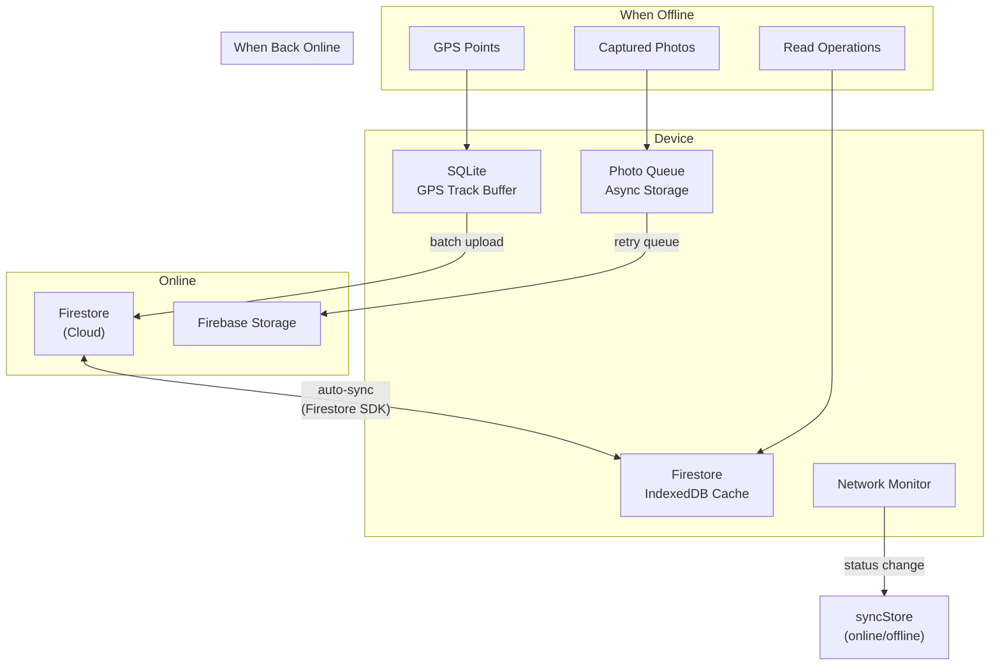
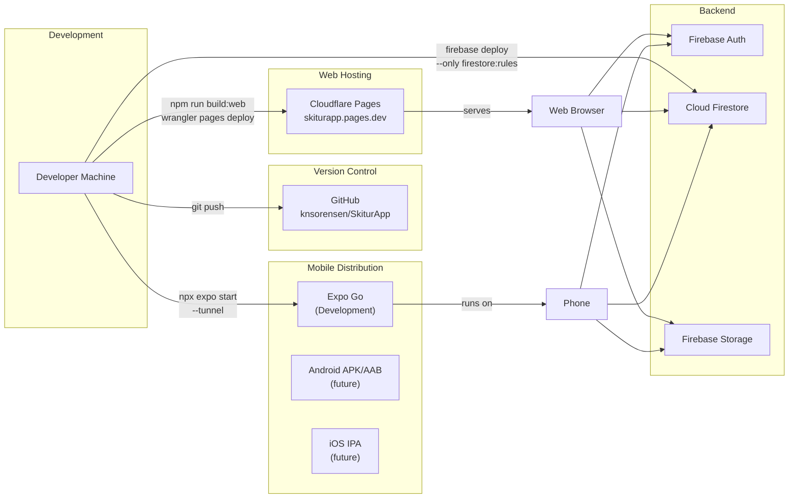

# SkiturApp - System Architecture

## Overview

SkiturApp is a React Native (Expo) mobile application for organizing ski touring trips. It runs on Android, iOS, and Web, with Firebase as the backend and Cloudflare Pages for web hosting.

---

## System Overview Diagram

```
┌─────────────────────────────────────────────────────────────────┐
│                        CLIENTS                                  │
│                                                                 │
│   ┌──────────┐     ┌──────────┐     ┌──────────────────────┐   │
│   │ Android  │     │   iOS    │     │    Web (Browser)     │   │
│   │ (Expo)   │     │ (Expo)   │     │ (Cloudflare Pages)   │   │
│   └────┬─────┘     └────┬─────┘     └──────────┬───────────┘   │
│        │                │                       │               │
│        └────────────────┼───────────────────────┘               │
│                         │                                       │
│              React Native (Expo SDK 55)                         │
│              TypeScript + Zustand stores                        │
└─────────────────────────┬───────────────────────────────────────┘
                          │
          ┌───────────────┼───────────────┐
          │               │               │
          ▼               ▼               ▼
   ┌────────────┐  ┌────────────┐  ┌─────────────┐
   │  Firebase   │  │  Firebase   │  │  Firebase    │
   │  Auth       │  │  Firestore  │  │  Storage     │
   │             │  │  (Database) │  │  (Photos)    │
   └────────────┘  └────────────┘  └─────────────┘
                          │
                          ▼
                   ┌────────────┐
                   │  External   │
                   │  APIs       │
                   │             │
                   │ - MET.no    │
                   │   (Weather) │
                   │ - Sporet.no │
                   │   (Trails)  │
                   │ - Google    │
                   │   Maps SDK  │
                   └────────────┘
```

---

## Application Architecture



---

## Data Flow



---

## Firestore Data Model



---

## Navigation Structure



---

## GPS Tracking Flow



---

## Offline Architecture



---

## Deployment Architecture



---

## External API Integration

### MET Norway Weather API

- **Endpoint:** `https://api.met.no/weatherapi/locationforecast/2.0/compact`
- **Auth:** None (public API, requires proper `User-Agent` header)
- **Usage:** Weather forecasts on trip detail and home screen
- **Data:** Temperature, wind, precipitation, weather symbols
- **Cache:** Client-side only (no Cloud Function caching yet)

### Sporet.no Ski Trail API

- **Endpoint:** `https://tracemap.sporet.no/api/tracemap`
- **Auth:** None (public API)
- **Usage:** Ski trail overlay on maps, shortest route calculation
- **Data:** Trail coordinates, type (classic/skating/scooter), grooming status

### Google Maps SDK

- **Usage:** Native map rendering on Android/iOS (terrain view)
- **Auth:** API key via `EXPO_PUBLIC_GOOGLE_MAPS_API_KEY` env variable
- **Web:** Replaced by a stub — maps not available on web

---

## Technology Stack Summary

```
┌─────────────────────────────────────────────────┐
│                   FRONTEND                       │
│                                                  │
│  React Native 0.83 + Expo SDK 55                │
│  TypeScript 5.9 (strict mode)                   │
│  React 19.2                                      │
│                                                  │
│  State:       Zustand 5                          │
│  Navigation:  React Navigation 7                 │
│  Maps:        react-native-maps 1.26             │
│  HTTP:        fetch (native)                     │
│  Queries:     @tanstack/react-query 5            │
│  Date:        date-fns 4                         │
│  Icons:       @expo/vector-icons (Ionicons)      │
│                                                  │
├─────────────────────────────────────────────────┤
│                   BACKEND                        │
│                                                  │
│  Firebase Auth       (email/password)            │
│  Cloud Firestore     (NoSQL database)            │
│  Firebase Storage    (photo storage)             │
│                                                  │
├─────────────────────────────────────────────────┤
│                   LOCAL STORAGE                  │
│                                                  │
│  SQLite              (GPS track buffer)          │
│  AsyncStorage        (photo queue, prefs)        │
│  IndexedDB           (Firestore offline cache)   │
│                                                  │
├─────────────────────────────────────────────────┤
│                   DEPLOYMENT                     │
│                                                  │
│  Web:     Cloudflare Pages (skiturapp.pages.dev) │
│  Mobile:  Expo Go (dev) / EAS Build (prod)       │
│  CI/CD:   Manual (future: GitHub Actions)        │
│                                                  │
├─────────────────────────────────────────────────┤
│                   DEV TOOLS                      │
│                                                  │
│  Testing:    Jest + ts-jest                      │
│  Linting:    ESLint + TypeScript ESLint          │
│  Formatting: Prettier                            │
│  Build:      Metro Bundler (Expo)                │
│                                                  │
└─────────────────────────────────────────────────┘
```

---

## Security Model

### Firebase Auth
- Email/password authentication
- Auth state persisted across sessions

### Firestore Rules (simplified)
| Collection | Read | Write |
|---|---|---|
| `users/{uid}` | All authenticated | Owner only |
| `trips/{id}` | All authenticated | Participants only (create: any auth user) |
| `trips/{id}/route` | All authenticated | Participants only |
| `trips/{id}/messages` | All authenticated | Any authenticated |
| `trips/{id}/photos` | All authenticated | Any authenticated |
| `trips/{id}/shoppingList` | All authenticated | Participants only |
| `trips/{id}/tripInvites` | All authenticated | Any authenticated |
| `invites/{id}` | All authenticated | Any auth (update: pending only) |

### API Keys
- Google Maps API key: stored in `.env` (gitignored), loaded via `EXPO_PUBLIC_` prefix
- Firebase config: hardcoded in `firebase.ts` (safe for client-side Firebase SDK)
- MET Norway: no key required (User-Agent header only)
- Sporet.no: no key required
